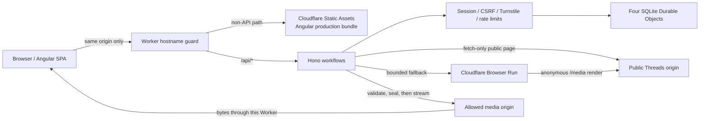

# Threads Downloader 維護與部署手冊

Threads Downloader 是公開 Threads 貼文的影片解析與同源串流服務。Angular SPA、
API 與下載都由同一個 Cloudflare Worker origin 提供；瀏覽器只取得 opaque ID 與
安全中繼資料，不會取得媒體來源 URL。Production resolver 先使用 Worker `fetch`；
只有受控的靜態解析結果允許 fallback 時，才使用 Browser Run Quick Action。兩條路徑
都不登入、不帶 Threads／Instagram Cookie，也不繞過任何存取控制。

本文件是維運與部署 runbook。架構決策詳見 [DESIGN.md](../DESIGN.md)，外部狀態
與平台證據邊界詳見 [研究紀錄](research)。

## 目前狀態與證據邊界

正式服務入口為 <https://threads.pylot.dev/>。這只能證明既定公開入口；每次維運仍須對
當次 commit、GitHub Actions、Sonar、Cloudflare deployment、Route、Turnstile、
secrets 名稱與 Durable Objects 做唯讀查證，不得沿用過往執行紀錄推論現況，也不得
把 mock 測試當成真實貼文解析成功的證據。

任何操作前都要重新唯讀盤點。若遠端狀態和既定決策衝突、需要額外權限或費用、
遠端 `main` 移動、出現未知 worktree 變更，或要求 MFA／CAPTCHA，立即停止並交由
帳號擁有者處理。

## 架構與同源資料流



- `apps/web`：Angular standalone SPA、typed reactive forms、signals、OnPush 與法律頁。
- `apps/worker`：hostname guard、Hono API、上游解析、媒體驗證與串流。
- `packages/contracts`：前後端共享的嚴格 request／response decoder。
- `wrangler.jsonc`：Static Assets、exact `BROWSER` binding、production vars、四個 secret
  名稱與四個 SQLite DO export；不管理 Route、Custom Domain 或 DNS。
- `wrangler.dev.jsonc`：只供本機 Wrangler dev，使用 localhost host/origin 與
  non-production Turnstile test site key。
- `.github/workflows/main.yml`：唯一 workflow，依序執行 `verify → sonar → deploy`。

完整流程是：瀏覽器建立匿名 session，提交權利確認與一次性 Turnstile token；
Worker 驗證 exact host、Origin、CSRF、session 與 rate limit，再先以 `fetch` 解析公開
貼文；符合有限 fallback 條件時才以 Browser Run 解析並驗證候選。來源 URL 在伺服器
端密封，前端只看到 opaque candidate ID。
使用者選擇後建立綁定 session 的 Download DO，再由同 origin 下載端點串流 bytes。

## 固定工具鏈

下列值來自 `package-lock.json`；不得用浮動 major／minor 取代：

| 工具                               | Exact version |
| ---------------------------------- | ------------- |
| Node.js                            | `24.18.0`     |
| npm                                | `11.16.0`     |
| Angular framework                  | `22.0.8`      |
| Angular CLI / build / compiler-cli | `22.0.8`      |
| TypeScript                         | `6.0.3`       |
| RxJS                               | `7.8.2`       |
| Hono                               | `4.12.32`     |
| Wrangler                           | `4.114.0`     |

`.nvmrc`、`.node-version`、`package.json` 與 GitHub Actions 都固定 Node
`24.18.0`。Node.js 只用於本機工具、build、test 與 Wrangler CLI；Cloudflare
Workers Runtime 不是 Node.js 24。

## 本機安裝與開發

先確認版本，再以 lockfile 安裝：

```sh
node --version
npm --version
npm ci
```

只開 Angular 開發伺服器：

```sh
npm exec --workspace=@threads-downloader/web -- ng serve \
  --configuration development --host 127.0.0.1 --port 4200
```

完整同源 Worker 開發需要先建立 production bundle，再由 Wrangler 提供 Assets 與
API。本機 dev 必須使用 `wrangler.dev.jsonc`，不得使用 production
`wrangler.jsonc`。只有 `.dev.vars` 尚不存在時才從範例建立，避免覆寫既有本機值：

```sh
if test ! -e .dev.vars; then
  install -m 600 .dev.vars.example .dev.vars
fi
CI=1 npm run build:web
npm exec -- wrangler dev --local --ip 127.0.0.1 --port 8787 \
  --config wrangler.dev.jsonc
```

`.dev.vars.example` 只有刻意無效的 placeholder。請在被 `.gitignore` 排除的
`.dev.vars` 中換成獨立的非 production 測試值；前三個 key 仍須符合下節的不同
encoding 契約，Turnstile 使用 Cloudflare 官方 test secret 或受控本機值。絕對不要
把 production secret 複製到 `.dev.vars`、`.env`、shell history 或 repository。
受控 Turnstile 值只適合啟動與 fail-closed 路徑；成功流程必須在 `.dev.vars` 同時
覆寫 `TURNSTILE_SITE_KEY` 與 `TURNSTILE_SECRET`，使用 Cloudflare 官方相配的
non-production test pair，或改用 automated fake。不可讓 production site key 與
test secret 混用。開啟服務時使用 `http://localhost:8787`，不要用 IP hostname，
因為範例的 dev host guard 只允許 `localhost`。前端變更後需重跑
`CI=1 npm run build:web`，Wrangler 才會提供新的 bundle。

### 完整本機 gate

以下命令涵蓋目前 package scripts、CI 測試邊界與 production build：

```sh
npm ci
npm audit --audit-level=low
npm run format:check
npm run lint
npm run typecheck
npm run test
npm run test:do
npm run test:range
npm run test:security
npm exec playwright install chromium
npm run test:e2e
npm run test:accessibility
npm run coverage
CI=1 npm run build
npm run security:bundle
npm run security:wrangler
npm run security:deploy-ready
npm run worker:dry-run
git diff --check
```

`CI=1 npm run build` 會使用 Angular 的預設 `production` configuration，並同時驗證
其他 workspace build。`security:deploy-ready` 只驗證已 build bundle 的 production
法律狀態 marker；它不是法律意見，也不能取代人工法務審閱。

## Static Assets、API 優先與公開入口

`wrangler.jsonc` 把 `dist/web/browser` 綁定為 `ASSETS`，使用 SPA fallback，且
`run_worker_first: true`。Worker 的順序不可改成 assets-first：

1. `fetch` 一開始以 `new URL(request.url).hostname` 比對 `EXPECTED_HOST`。
2. 不相符時直接回傳通用 `404`；不 redirect、不相信 `X-Forwarded-Host`，也不洩漏
   正確 host 或 Worker 名稱。
3. `/api/*` 先由 Hono 處理；未知 API 回傳 JSON `404`，不能落入 Angular
   `index.html`。
4. 只有非 API path 才呼叫 `env.ASSETS.fetch()`；不對本站做遞迴 origin fetch。
5. 所有 response 統一套用 CSP、HSTS、nosniff、CORP、Permissions Policy 與
   `no-referrer`，並移除 `access-control-*`，因此不開放 CORS。

Production 公開面必須同時符合：

- `workers_dev: false` 與 `preview_urls: false` 明確存在。
- 不存在 Worker Custom Domain、Pages Custom Domain 或其他本專案公開 Route。
- 既有 Proxied CNAME 完全保持不變。
- Route 只由 Cloudflare Dashboard 一次性管理，exact pattern 為
  `threads.pylot.dev/*`，指向 `threads-downloader`。

既有 wildcard Route 不可刪除。Cloudflare 會選最具體的 exact Route，並不會把
exact Worker 與 wildcard 上的 `header-rule` 自動串成 middleware chain；因此本
Worker 必須維持自己的完整 security headers。`wrangler.jsonc`、CI 與 deployment
token 都不得取得 Route／DNS／Custom Domain 管理能力。

## Browser Run fallback 與用量監控

Production configuration 已依帳號擁有者的明確付費授權選擇啟用 Browser Run；
`wrangler.jsonc` 必須有且只能有 `{ "browser": { "binding": "BROWSER" } }`。
`npm run security:wrangler` 會對 missing、名稱錯誤、`remote`、額外欄位與非 object
設定 fail closed。本機 `wrangler.dev.jsonc` 與測試可不綁定 Browser Run，不能把
production binding 改成 remote development 設定。

每次 resolve 的 admission 與 fallback 順序固定如下：

1. 驗證 exact host／Origin、session、CSRF 與輸入 URL，取得 session 及 IP resolve
   permit，完成一次性 Turnstile 驗證。
2. 先用較便宜的靜態 markup resolver。只有 JavaScript-required、找不到 media、
   response-invalid、response-too-large 或 `THREADS_UPSTREAM_UNAVAILABLE` 才能進入
   Browser Run；最後一項只代表同一個公開 Threads origin 的無 credential markup
   transport 失敗。login、access、bot、rate、redirect 或 policy failure 不得以渲染
   繞過。
3. 租約剩餘時間足夠時，對 server 自行正規化並附加 `/media` 的網址執行匿名、有界
   Quick Action；不傳 Cookie、client headers 或 referrer。供應端最多等待五秒，直到
   可見的 `video[src]` 出現，再保留 250 ms 穩定時間；這兩者都在每次既有六秒 action
   limit 內。第一次只有在 exact `RENDERED_MEDIA_NOT_FOUND` 且仍有 38 秒租約時，才能對
   相同 canonical post 再做一次；第二次之後不再重試。
4. 只接受 canonical 與 Open Graph identity 都吻合、且至少一個允許 CDN 候選的結果；
   多個候選依 scrape／DOM 順序穩定選第一個。候選仍須通過既有 media probe、vault 與
   同源下載流程。

Browser Run 是按用量計費且受平台 quota 限制。部署前後要在 Cloudflare Browser Run
的 **Overview** 與 **Runs** 檢查總 sessions、browser hours、Quick Action requests、
失敗情況與當下 quota；異常增加時先停止新的 rollout 並查明原因，不可放寬 host、
Cookie、headers、origin、selector 或重試限制。repository 只證明預期 binding，不能
證明目前 Dashboard inventory、用量、quota 或帳務狀態。

2026-07-27 的 post-fix direct-import proof 在 local revision `9c09651` 對指定公開
單影片貼文發出恰好一次無 credential Quick Action，HTTP 200，3,379 ms，得到恰好
一個 `rendered-video` 候選且 hostname 通過既有 CDN policy。這份證據只涵蓋該貼文、
單次匿名執行與當時區域；不證明 browser final URL／redirect chain，也不涵蓋
carousel、圖片、私人／已刪除貼文、登入／challenge 頁、跨貼文 DOM 或 hostname 的
長期穩定性。

同日指定 production resolve 的 PII-free telemetry 在 `resolve` stage 記錄 exact code
`THREADS_UPSTREAM_UNAVAILABLE`；不記錄 sensitive request ID。因為同一貼文的上述直接
remote proof 已成功，這個 typed transport failure 納入 bounded fallback。這不是
access-control bypass：兩條路徑都只匿名存取同一個公開 Threads origin，不傳 Cookie、
client headers 或 credentials；renderer 仍只使用 server 建立的 canonical `/media`
網址，要求 canonical 與 Open Graph identity 一致且至少一個允許候選，依 scrape／DOM
順序選第一個，並繼續通過既有
media probe、encrypted vault 與 same-origin download。login、access-denied、rate-limited、
bot-blocked、redirect 與 policy failure 仍不得進入 Browser Run。

後續 fresh production session 在固定等待三秒的版本中，於 `resolve` stage 記錄 exact
code `RENDERED_MEDIA_NOT_FOUND`。較早的匿名 Quick Action 使用可見 `video[src]` 的五秒
上限等待再加 250 ms 穩定時間，約 3.8 秒完成，diagnostic response 當時有
`video[src]`。因此 renderer 改為等待實際 selector，而不是假設固定 hydration 時點；
這份觀察不代表所有 Threads 貼文都會在相同時間出現影片，也不保證每個有效貼文都有
可下載 media。

同日 exact production resolver 的重複 remote-dev 診斷，在相同匿名公開貼文上觀察到
第一次零候選、後續一次單一有效候選，也另觀察到 canonical／Open Graph identity 皆
吻合但有三個不同候選的結果。工作流程因此只吸收第一次 exact
`RENDERED_MEDIA_NOT_FOUND` 的瞬時波動；首試成功不重試，多候選依順序取第一個，
identity、provider、transport、格式或 policy failure 都不重試。重試前至少須剩餘 38
秒，涵蓋第二次最多
12 秒 rendered resolver、8 秒 probe、兩次各 8 秒 vault 與 2 秒 margin，總流程不超過
既有 60 秒 permit；失敗路徑最多消耗兩次 Browser Run 計費請求。兩次獨立的 fresh
production request 都曾得到零候選，因此這個重試只降低瞬時失敗機率，不保證不同執行
區域都能恢復。

renderer timing 修正後，fresh production resolve 已到達 media probe，PII-free telemetry
只記錄 exact code `MEDIA_PROBE_UNAVAILABLE`；同一公開候選的 direct remote proof 則成功
完成 HEAD。這只支持「Worker fetch transport 曾短暫失敗」，不證明 CDN 長期行為。初始
HEAD 只有在拋出該 typed unavailable error 時，才會對原始已重新驗證候選補一次
`Range: bytes=0-0` GET；沿用同一個八秒 AbortSignal、零起始 redirect count、manual
redirect、CDN allowlist、identity encoding 與既有 response metadata 驗證。HEAD abort、
policy、status 或 metadata failure 不得補 GET；HEAD 若已耗盡 deadline，已 aborted 的
signal 會讓補 GET 立即安全失敗，不建立新 timeout 或 retry loop。一般無 redirect 路徑
每個候選最多兩個外部 subrequests；既有 redirect 上限與 DESIGN 的最壞五個 subrequests
預算不變。

media probe 與 download delivery 共用固定的 Chromium 119 User-Agent，值與本專案已安裝的
Cloudflare Browser Run 型別所記載的預設值一致，用來對齊能成功載入同一公開候選的 renderer
請求外觀。這是無 credential 的相容性設定，不是冒用登入身分：不加入 Cookie、Origin、
Referer、client headers 或瀏覽器 `sec-*` headers，request 仍固定 `credentials: omit`、空
referrer 與 `no-referrer`。host allowlist、redirect、timeout、retry、range 與 response
metadata 規則都不變。此變更是否能排除 `MEDIA_PROBE_UNAVAILABLE`，仍須以 fresh production
resolve 及同源 download 成功後才能確認。

## API 與下載契約

主要端點為 `/api/health`、`/api/session`、`/api/resolve`、
`/api/download-sessions`、`/api/download/:downloadId` 與
`/api/download-status/:downloadId`。下載端點支援 `GET`／`HEAD`；`HEAD` 只讀安全
metadata，不建立、消耗或完成 session。

Download Session 的邏輯狀態是：

| 狀態               | 意義與轉移                                                               |
| ------------------ | ------------------------------------------------------------------------ |
| `ISSUED`           | 已核發；必須在 120 秒內開始                                              |
| `ACTIVE`           | 至少有一個有效 stream lease；最多四個平行的單一 Range                    |
| `INTERRUPTED`      | 沒有 active lease，但仍可在 idle／absolute deadline 前續傳               |
| `COMPLETE_PENDING` | 伺服器確認完整 representation；進入 90 秒 grace，合法重試可回到 `ACTIVE` |
| `EXPIRED`          | 邏輯上不可再用；alarm 清除資料，後續公開請求為 Gone                      |

其他期限為：idle 600 秒、absolute lifetime 3600 秒、stream lease 900 秒、最多
64 個合併 interval。只有 normal EOF、實際 byte count 正確、Range 聯集覆蓋整個
representation、可靠 validator 一致且沒有 active lease，才可判定
`SERVER_CONFIRMED_FULL_TRANSFER`。這不代表瀏覽器已寫入硬碟或使用者本機下載完成。

Range 契約支援完整 GET、單一 byte range、平行的單一 Range requests、`If-Range`、
strong ETag／Last-Modified 與 `206`。上游固定 `Accept-Encoding: identity`；同一個
header 的 multi-range 會被拒絕為 `416`。Worker 以 Web Streams 傳遞 bytes，不把
整部影片轉成 `Blob`／`ArrayBuffer`，也不把內容保存到 DO、KV、D1 或 R2。

## Worker Secrets 與 Turnstile

Production 恰好需要四個 Worker Secret；名稱可查，值不可讀取、顯示、記錄或放入
GitHub／`.env`／Angular bundle：

| Secret                     | 精確契約                                                                   | 輪替影響                                                         |
| -------------------------- | -------------------------------------------------------------------------- | ---------------------------------------------------------------- |
| `DOWNLOAD_ENCRYPTION_KEY`  | 32 bytes 的 canonical、unpadded base64url；正好 43 chars                   | 現有 DO 密封媒體資料會立刻無法解開，最長影響 1 小時 absolute TTL |
| `RESOLVED_MEDIA_GRANT_KEY` | 32 bytes 的 canonical、padded standard base64；正好 44 chars 且以 `=` 結尾 | 現有 resolved-media grant 最長 5 分鐘內失效                      |
| `SESSION_SIGNING_KEY`      | 32 bytes 的 canonical、padded standard base64；正好 44 chars 且以 `=` 結尾 | 所有現有匿名 session cookie 失效，使用者須建立新 session         |
| `TURNSTILE_SECRET`         | Cloudflare 為 production widget 提供的值；不得自行生成                     | 切換後必須重新驗證完整 resolve 流程                              |

前三個 key 不是同一種 encoding。若 Worker 已存在，下列命令會把新值直接經 pipe
交給 Wrangler，不在終端顯示 key，也不建立 secret file：

```sh
node --input-type=module -e \
  'import { randomBytes } from "node:crypto"; process.stdout.write(randomBytes(32).toString("base64url"))' \
  | WRANGLER_WRITE_LOGS=false npm exec -- wrangler secret put \
      DOWNLOAD_ENCRYPTION_KEY --config wrangler.jsonc

node --input-type=module -e \
  'import { randomBytes } from "node:crypto"; process.stdout.write(randomBytes(32).toString("base64"))' \
  | WRANGLER_WRITE_LOGS=false npm exec -- wrangler secret put \
      RESOLVED_MEDIA_GRANT_KEY --config wrangler.jsonc

node --input-type=module -e \
  'import { randomBytes } from "node:crypto"; process.stdout.write(randomBytes(32).toString("base64"))' \
  | WRANGLER_WRITE_LOGS=false npm exec -- wrangler secret put \
      SESSION_SIGNING_KEY --config wrangler.jsonc
```

Turnstile secret 必須從 Cloudflare 取得，再直接輸入 Wrangler 的隱藏 prompt：

```sh
WRANGLER_WRITE_LOGS=false npm exec -- wrangler secret put \
  TURNSTILE_SECRET --config wrangler.jsonc
```

不得把 secret 放進命令列參數。完成後只用 `wrangler secret list` 或 Dashboard 確認
四個名稱存在，不嘗試讀值：

```sh
npm exec -- wrangler secret list --config wrangler.jsonc
```

### Rotation runbook

1. 先記錄非敏感 deployment/version snapshot，通知使用者可能中斷，並確認沒有
   其他遠端變更。
2. `DOWNLOAD_ENCRYPTION_KEY`：必須先停止核發新 download session，再等完整一小時
   absolute TTL 或確認使用時段已清空，才可執行上述 pipe rotation。現有程式沒有
   maintenance switch；若無法保證這個 quiet window，就不要輪替，先另外設計並
   核准維護機制。
3. `RESOLVED_MEDIA_GRANT_KEY`：停止產生新 grant 並等五分鐘，或明確接受已核發 grant
   失效後再換 key。
4. `SESSION_SIGNING_KEY`：視為刻意的全站匿名 session reset；安排維護時段、更新後
   驗證 `/api/session` 能建立新 cookie。
5. `TURNSTILE_SECRET`：依 Cloudflare 當時提供的 rotation 流程取得新值，先更新
   Worker secret，再驗證 widget、Siteverify、hostname、`action=resolve` 與
   one-time replay。現況沒有確認雙 secret／重疊切換能力，不得假設 zero-downtime
   或自行描述雙值流程。
6. 每次只輪替一個 secret；完成 health、session、受控 resolve 與負向驗證後，才
   進行下一個。任何輸出或 artifact 都只能包含名稱與 pass/fail，不能含值或 token。

Angular 只取得公開 site key；secret 僅存在 Worker binding。Production widget 必須
只允許 exact hostname，前後端 action 固定為 `resolve`。Worker 呼叫 Siteverify，
驗證 success、hostname、action 與 freshness，並把 token hash 放入
`TURNSTILE_REPLAYS` 五分鐘以拒絕重放。Production widget 必須是 Managed 模式，
只允許 exact hostname `threads.pylot.dev`，公開 site key 也必須與
`wrangler.jsonc` 相符。每次部署前都要唯讀重新核對這些非敏感設定，並只確認四個
required Worker Secret 的名稱存在；不得讀取、記錄或根據過往狀態猜測其值。

## Durable Objects 與 lifecycle boundary

`wrangler.jsonc` 以頂層 SQLite `exports` 宣告四個 class，不混用 legacy
`migrations`：

| Binding             | Class                | 責任                                              |
| ------------------- | -------------------- | ------------------------------------------------- |
| `SESSIONS`          | `SessionCoordinator` | 匿名 session、CSRF、resolve grant 與 session 限制 |
| `IP_RATE_LIMITS`    | `IpRateLimiter`      | hashed-IP 解析限流與 12 小時工作階段核發額度      |
| `TURNSTILE_REPLAYS` | `TurnstileReplay`    | 一次性 Turnstile token hash                       |
| `DOWNLOAD_SESSIONS` | `DownloadSession`    | 加密媒體 metadata、Range、lease、狀態與 alarm     |

第一次 production deploy 會 provision 四個持久 SQLite namespace。這是不可用一般
Worker rollback 跨回建立前的 lifecycle boundary，即使 namespace 尚未寫入業務
資料也一樣；因此執行前必須取得「建立這四個 namespace」的專門明確核准。一般
部署核准、Route 核准或帳號可使用 DO 都不能代替它。日後 tombstone／永久刪除是
另一個不可逆 boundary，也必須另行評估與核准。

## SonarQube、CI 與 main-only gate

`sonar-project.properties` 是 project key、organization、source/test 範圍與四份
LCOV path 的唯一真實來源。不得在 README 複製 private account metadata。正式
部署要求同一 commit 同時符合：

- Quality Gate 明確為 `OK`，且 coverage 通過既有門檻。
- Bugs、Vulnerabilities、Code Smells、Security Hotspots to review、Duplicated
  Lines 與 Duplicated Lines Density 全部為 `0`。
- 不降低 Gate、不關閉規則、不用 `NOSONAR`、不把主要 source 或低 coverage source
  排除，也不以無意義測試操縱 coverage。

`verify` 以 immutable SHA checkout，執行 pinned Gitleaks commit-range secret scan、lockfile
install、audit、format、lint、typecheck、四份 coverage、DO／Range／security
tests、mock E2E、accessibility、production build、bundle secret scan、Wrangler
exposure scan 與 dry-run，再上傳同 SHA 的 LCOV。`sonar` 只在 `verify` 成功後執行
並等待 Gate，再以 `security:sonar` 核對 exact analysis revision 與 zero findings。
`deploy` 只在前兩個 job 成功後部署同一 SHA，使用 GitHub `production`
Environment，且 environment URL 為正式網站；部署前再執行 bundle、exposure 與
legal readiness checks。沒有 skip、ignore 或 force bypass。

Workflow 在 push 事件中的 Gitleaks 只依 pinned action 的固定版本掃描該次
push commit range，不代表每次都重新掃描完整 Git history。正式 push 前必須另行
完成一次本機完整 history secret scan；兩者不可互相取代。

GitHub Actions 只需要三個 secret 名稱：`SONAR_TOKEN`、
`CLOUDFLARE_API_TOKEN`、`CLOUDFLARE_ACCOUNT_ID`。三者都必須存成 GitHub
repository Actions secrets，值不能進 repository 或 log。GitHub `production`
Environment 已建立，目前承載 environment metadata、environment URL 與 deployment
record，不儲存上述任何 secret。目前沒有證據顯示已設定 required reviewers 或人工
approval gate；若未來需要這項保護，必須另行明確設定並驗證，在那之前不得宣稱
現有人工 gate。長期 Cloudflare token 只留在 repository Actions secret，從 Account
`Workers Scripts: Write` 開始，且只 scope 到實際部署帳號；不得加入
Routes、DNS、Zone Settings、SSL、Account Settings、Billing、all-accounts／
all-zones 或 Global API Key。若 API 拒絕，保存已遮蔽的 endpoint／error，找出精確
缺少的 permission，先取得使用者核准，不能自行擴權。

開發只在 `main`：不建立 branch／PR，不 force push，不 rebase 或 reset 已推送歷史，
也不使用 `--no-verify`。每個可獨立驗證的功能使用 Conventional Commit，且該 commit
必須可 build、相關測試通過；避免把無關功能混在一起，也不要為 coverage 製造
臃腫測試。原子 commits 可先留在本機，但 push 前必須重跑完整 gate：

```sh
git fetch origin main:refs/remotes/origin/main
git status --short
git merge-base --is-ancestor origin/main main
git rev-list --left-right --count main...origin/main
```

只有 status 為 clean、ancestor check 成功，且 rev-list 的 remote-only（右側）為
`0` 才可 push；正常待推結果是 `N 0` 且 `N >= 1`，`0 0` 代表沒有新 commit 可推。
若右側不是 `0` 或 ancestor check 失敗，表示遠端更新或已分岔，立即停止；不要
merge、rebase、reset 或 stash 來掩蓋衝突。

## 首次部署或全新環境重建 runbook

正式站已有既定公開入口；本節不是日常部署流程。只有在唯讀查證確認是全新環境、
重新取得所有 lifecycle 核准，且不會覆蓋現有 Worker、Route、namespace 或 secrets
時才可使用。一般更新應走 `main` 的完整 CI gate 與 deploy job。

### 1. Freeze、快照與 gate

1. 確認 repository、branch 與 remote 正確，working tree clean，`main` 與
   `origin/main` 完全一致；記錄即將部署的完整 SHA。
2. 把 placeholder 換成實際值後建立不 push 的本機安全 tag：
   `git tag pre-codex-YYYYMMDD-HHMMSS RECORDED_SHA`。
3. 在 Dashboard 唯讀記錄 CNAME/Proxy、所有 Routes、Custom Domains、workers.dev、
   Preview URLs、Worker 是否存在、secret 名稱、DO namespace 與方案狀態。不得記錄
   secret 值或 account ID。若 CNAME 不再 Proxied、同名 Worker 有未知用途、exact
   Route 指向其他服務、已有其他公開入口，或需要付費／擴權，立即停止。
4. Worker 若已存在，執行下列命令記錄 current version 與上一個正常 deployment；
   若不存在，明確記 `first deployment`，不要捏造 ID。

   ```sh
   npm exec -- wrangler deployments list --config wrangler.jsonc
   ```

5. 唯讀重新核對已存在的 production Managed Turnstile widget 只允許 exact
   hostname。公開 site key 必須和 `wrangler.jsonc` 相同，且下一節輸入的 secret 必須由同一個
   widget 提供；若不配對，先停止。若 site key 不同，先以 atomic commit 更新設定
   並重跑所有 gate。Secret 只在下一節 hidden prompt 使用，不另行記錄。
6. 執行完整本機 gate，並確認 GitHub Actions 的同一 SHA 已完成 `verify` 與
   `sonar`。只有 Sonar Gate 明確 `OK` 且 zero-issue check 成功才可繼續。
7. 再次取得四個 SQLite namespace 首次建立的專門核准。此項目前是待執行 gate。

### 2. 安全 bootstrap 四個 secrets 與第一版

Wrangler 4.114.0 的本機契約已確認：當 Worker 不存在且設定有
`secrets.required`，`secret put` 不能預先滿足 first deploy；而直接執行
`secret put` 會提議建立 draft Worker。不要接受這個未納入 exposure snapshot 的
隱式 draft 路徑，也不要把 secrets 寫入一般檔案。本節唯一用途是在相同
SHA 的 Sonar Gate 明確 `OK` 後，解開「新 Worker 尚不存在」與
`secrets.required` 的首次部署循環依賴；它不是日常部署路徑。

執行前，必須在與 target Worker 相同的 Cloudflare 帳號建立本機一次性、短效的
API token。權限只允許 Account `Workers Scripts: Write`，並只 scope 到這個
exact account；不得使用 Global API Key，也不得加入 Route、DNS、Zone 或其他
權限。不得重用 GitHub Actions 的長期 token。臨時 token 與 target account ID
只能透過下列 hidden prompt 進入當前 shell 記憶體，不得寫入檔案、shell
history、命令列或 log。命令會同時顯式覆寫這兩個 Wrangler 環境變數，不繼承
本機現有的 account 選擇。

在已完成上節核准與同 SHA Sonar gate 後，以 zsh 執行下列一次性 FIFO bootstrap。
FIFO 權限為 `0600`，secret JSON 只在 process pipe 中流動、不落碟；命令會一併
建立 Worker、設定四個 secrets 並跨越首次 DO lifecycle boundary：

```zsh
(
  set -e
  umask 077
  read -rs 'TD_BOOTSTRAP_API_TOKEN?Temporary Cloudflare API token (hidden): '
  printf '\n'
  read -rs 'TD_BOOTSTRAP_ACCOUNT_ID?Target Cloudflare account ID (hidden): '
  printf '\n'
  read -rs 'TD_TURNSTILE_SECRET?Turnstile secret (hidden): '
  printf '\n'

  if test -z "$TD_BOOTSTRAP_API_TOKEN" || \
    test -z "$TD_BOOTSTRAP_ACCOUNT_ID" || \
    test -z "$TD_TURNSTILE_SECRET"; then
    unset TD_BOOTSTRAP_API_TOKEN TD_BOOTSTRAP_ACCOUNT_ID TD_TURNSTILE_SECRET
    exit 2
  fi

  TD_SECRET_PIPE_DIR="$(mktemp -d)"
  TD_SECRET_PIPE="$TD_SECRET_PIPE_DIR/secrets.json"
  TD_SECRET_WRITER_PID=''
  mkfifo -m 600 "$TD_SECRET_PIPE"
  cleanup_td_secret_pipe() {
    TD_SECRET_EXIT_STATUS=$?
    trap - EXIT HUP INT TERM
    set +e
    if test -n "$TD_SECRET_WRITER_PID"; then
      kill "$TD_SECRET_WRITER_PID" 2>/dev/null
      wait "$TD_SECRET_WRITER_PID" 2>/dev/null
    fi
    unset TD_BOOTSTRAP_API_TOKEN TD_BOOTSTRAP_ACCOUNT_ID TD_TURNSTILE_SECRET
    if test -p "$TD_SECRET_PIPE"; then
      unlink "$TD_SECRET_PIPE"
    fi
    if test -d "$TD_SECRET_PIPE_DIR"; then
      rmdir "$TD_SECRET_PIPE_DIR"
    fi
    exit "$TD_SECRET_EXIT_STATUS"
  }
  trap cleanup_td_secret_pipe EXIT
  trap 'exit 129' HUP
  trap 'exit 130' INT
  trap 'exit 143' TERM

  printf %s "$TD_TURNSTILE_SECRET" | node --input-type=module -e '
    import { randomBytes } from "node:crypto";
    import { readFileSync } from "node:fs";
    const turnstile = readFileSync(0, "utf8");
    if (!turnstile) process.exit(2);
    const standard = () => randomBytes(32).toString("base64");
    process.stdout.write(JSON.stringify({
      DOWNLOAD_ENCRYPTION_KEY: randomBytes(32).toString("base64url"),
      RESOLVED_MEDIA_GRANT_KEY: standard(),
      SESSION_SIGNING_KEY: standard(),
      TURNSTILE_SECRET: turnstile
    }));
  ' > "$TD_SECRET_PIPE" &
  TD_SECRET_WRITER_PID=$!
  unset TD_TURNSTILE_SECRET

  CLOUDFLARE_API_TOKEN="$TD_BOOTSTRAP_API_TOKEN" \
    CLOUDFLARE_ACCOUNT_ID="$TD_BOOTSTRAP_ACCOUNT_ID" \
    WRANGLER_WRITE_LOGS=false npm exec -- wrangler deploy \
      --config wrangler.jsonc --secrets-file "$TD_SECRET_PIPE"
  unset TD_BOOTSTRAP_API_TOKEN TD_BOOTSTRAP_ACCOUNT_ID
  wait "$TD_SECRET_WRITER_PID"
  TD_SECRET_WRITER_PID=''
)
```

不要把這段改成普通 temp file、process substitution 或 shell argument。Repository
目前的 Wrangler 在 macOS 對 process-substitution `/dev/fd` 不能當作
`--secrets-file` 讀取；FIFO 版本已用成功 dry-run 與 pre-open failure path 驗證。
若 command 回報失敗，只記錄已遮蔽錯誤，不輸出 FIFO 內容，而且不得立刻重試或
輪替 key：網路／CLI 失敗仍可能發生在 Cloudflare 已接受 Worker、secrets 或 DO
namespace 之後。先停止並唯讀盤點 Worker、deployments、四個 secret 名稱、bindings、
namespaces 與所有 exposure。只有能證明沒有建立任何遠端資源、也未跨越 lifecycle
boundary 時，才可使用全新 key 重新執行；部分成功或無法判定時，必須回報實際證據
並另訂恢復方案，不得猜測、刪除 namespace 或盲目 rollback。

Bootstrap 成功後必須立即在 Cloudflare Dashboard 撤銷這個本機臨時 token，
再執行後續驗證。若 bootstrap 失敗，只在完成上述唯讀遠端狀態盤點後立即
撤銷。不得把它保留為本機長效憑證；長效部署 token 只能留在 GitHub
repository Actions secret。

### 3. Dashboard exact Route

1. 唯讀確認部署後 `workers.dev` 與 Preview URLs 仍停用，沒有 Custom Domain 或
   額外公開 Route，四個 secret 名稱與四個 DO bindings／namespaces 存在。
2. 再確認 CNAME 仍為原 target 且為 Proxied；若不符就停止，不得修改 DNS、Proxy、
   SSL/TLS 或 nameserver。
3. 若 `threads.pylot.dev/*` 已正確指向 `threads-downloader`，只驗證、不重建。
   若 pattern 已存在但指向其他服務，停止且不得覆寫；只有 pattern 不存在時，才在
   Dashboard 建立這個唯一 exact Route。保留 wildcard 與其他服務 Route。
4. 不把 Route 加入 `wrangler.jsonc`、workflow 或 deployment token。
5. Bootstrap 後重新執行同 SHA 的完整 `verify → sonar → deploy`，確認 workflow
   可繼承既有 Worker secrets；第一次失敗的 deploy job 不能當作成功紀錄。從此
   以後的部署一律由 GitHub Actions 接管，不得再以本機 FIFO bootstrap 作為
   一般部署方式。

## 部署後驗證

正向 health check 不輸出 response body：

```sh
curl --fail --silent --show-error --retry 5 --retry-delay 5 \
  --retry-all-errors --max-time 30 --output /dev/null \
  https://threads.pylot.dev/
curl --fail --silent --show-error --retry 5 --retry-delay 5 \
  --retry-all-errors --max-time 30 --output /dev/null \
  https://threads.pylot.dev/api/health
```

接著完成負向 exposure 驗證：

1. `npm run security:wrangler` 必須通過；`apps/worker/test/index.spec.ts` 的 unexpected
   host cases 必須仍為 `404`，且不能信任 `X-Forwarded-Host`。
2. Dashboard 只能看到 exact Route；workers.dev、Preview URL、Custom Domain 與其他
   本專案 Route 均不存在或停用。
3. 對盤點中任何實際發現的非正式公開入口發出不含 credential 的 health request，
   必須不可連線或為通用 `404`。不要為測試臨時啟用公開入口，也不要在 artifact
   保存 preview URL。
4. exact host 的未知 `/api/*` 必須是 JSON `404`，不是 SPA；response 不得有 CORS
   allow header，首頁需有既定 security headers。
5. 用 mock／受控 upstream 完成 session、Turnstile、resolve、issue、HEAD、Range、
   interrupt/resume、`COMPLETE_PENDING` 與 90 秒 alarm 清除驗證。只記錄 pass/fail，
   不記錄 token、完整 opaque ID 或媒體來源 URL。

只有以上步驟有實際證據時，才可報告 deployed version、health 成功與 Sonar `OK`。

## Rollback

Rollback 前先確認目標 version 與目前 version 位於同一個 DO lifecycle epoch：

1. 把 `BAD_COMMIT_SHA` 換成已核對的實際 SHA，以 `git revert BAD_COMMIT_SHA` 產生
   新的 atomic commit；重跑所有 gate，再正常 push `main`。不得 reset、force
   push、amend 已推送 commit 或跳過 Sonar。
2. 若需先回復 Worker，從部署前 snapshot 選擇同 lifecycle boundary 的前一個正常
   version，核對後執行：

   ```sh
   npm exec -- wrangler rollback PREVIOUS_VERSION_ID --config wrangler.jsonc
   ```

   `PREVIOUS_VERSION_ID` 是必須先由 snapshot 核對並替換的非敏感 placeholder；不得
   直接照字面執行。

3. 驗證 exact host health、負向 hostname、security headers、session 與下載狀態；
   不修改 CNAME、Proxy、DNS、Route、Custom Domain 或 TLS。
4. 一般 Worker rollback 不可跨回四個 namespace 建立前，也不可跨越後續 class
   deletion／tombstone。遇到 lifecycle boundary 時停止，自動 rollback 不適用，需
   另做相容版本與資料處置計畫並取得明確核准。

## 真實解析與測試邊界

Production resolver 先使用 Web Platform `fetch`、manual redirect、allowlist、timeout
與大小限制；只有上一節列出的四種靜態解析結果才可使用有界 Browser Run Quick
Action。Browser Run 不是登入或存取控制繞過路徑，也不使用 Puppeteer、Playwright
或第三方下載 API；Playwright 僅用於 mock E2E。若公開頁需要登入、CAPTCHA、遭 bot
block、地區／年齡限制或 markup 改變，解析可能失敗。必須回傳誠實錯誤，不能登入、
上傳 Cookie、暴力重試或放寬安全邊界。

自動測試只用 mocks、fixtures 與受控 upstream。真實驗證最多使用使用者先前提供的
單一公開貼文，不批次、不負載測試、不繞 rate limit；遇到登入牆、CAPTCHA 或 bot
block 立即停止。不得把完整媒體來源 URL、query、opaque ID 或 response artifact
寫入 log／GitHub。真實測試尚未完成時只能標示「待執行」，不能由 mock 結果推論
production 解析成功。

## 學術研究、權利與法律服務邊界

本服務之設置與營運目的僅為技術及學術研究，營運者不藉提供本服務取得商業或
經濟利益。這項聲明不授予內容權利、不代表特定下載合法，也不構成免責：公開可見
不等於可自由利用；使用者必須擁有內容、取得有效授權，或依實際適用法律得為預定
使用。

服務只處理無需登入即可由一般公眾存取的公開 Threads 貼文，不處理私人或受限制
內容，也不規避登入、技術措施、CAPTCHA 或其他存取控制。本服務不是 Meta、
Instagram、Threads 或 SpaceX 的官方產品，亦未獲其背書或授權。

營運者顯示名稱為 **Pony**。著作權、下架、隱私或資料處理聯絡信箱為
[pony@pylot.dev](mailto:pony@pylot.dev)。詳細告知由網站 `/terms`、`/privacy` 與
`/copyright` 提供。

使用者已正式核准本服務上線。這是營運與部署決策，不是法律意見或合規結論；
本 README 與網站文字也不聲稱符合任一特定法域的法定通知、安全港或反通知
程序。營運期間應由合格法律專業人士依營運者所在地、實際資料流、利益模式、
平台條款與供應商政策定期審閱。正式上線核准不可被描述成專業法律審閱、特定法域
合規，或實際部署已完成的證據。
